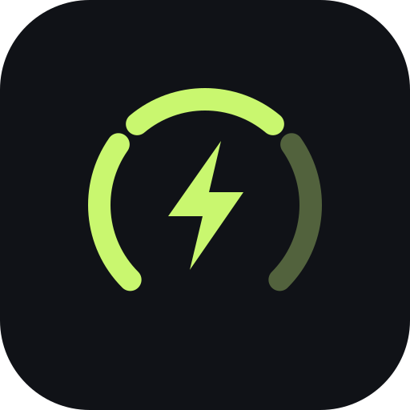

<p align="center">
  
</p>

# Vanguard Energy

An offline energy tracker for **two or four Cardfight!! Vanguard players**, rewritten in **Kotlin Multiplatform and Compose Multiplatform** for Android and iOS. Both apps share their tracker UI, energy rules, gesture handling, and preference validation.

[Android releases](https://github.com/tsunsora/energy-tracker/releases) · [Android and iOS builds](https://github.com/tsunsora/energy-tracker/actions/workflows/native-build.yml) · [Report an issue](https://github.com/tsunsora/energy-tracker/issues)

## At the table

| Control | Action |
| --- | --- |
| Upper **ADD** half of a player's area | Add 1 energy |
| Lower **REMOVE** half | Remove 1 energy |
| **+3** button | Add 3 energy, up to that player's limit |
| Hold **REMOVE** for 0.6 seconds | Reset that player to zero; slide away to cancel |
| Center setup button | Choose two or four players and set individual energy limits |

Controls face each player's side of the table. Players can act simultaneously, including repeated taps while another player holds a control. Player names are inert labels. With a control focused, Enter or Space adjusts energy; holding REMOVE for 0.6 seconds resets it. Moving keyboard focus or opening Setup cancels a pending hold. Accessibility actions also support adjustments and resets. There is no vibration. Counters and charge labels fit the available space with large system text settings.

Each counter stops at 10 by default. In **Setup → Allow energy above 10**, enable a player's switch to allow up to 9,999. Lower their energy to 10 before switching it off. Changing settings never silently discards energy.

Preferences save automatically. Counts stay in memory when switching apps, locking the screen, or recreating an Android activity. A fresh launch resets all four counts, including hidden players. Android Back dismisses Setup, then closes the tracker. Both platforms request portrait orientation and keep the display awake while foregrounded. Setup scrolls while its Done button stays accessible.

No account, ads, tracking, or network connection is required. The app bundles its fonts and icons. Android has no Internet permission. The React/Vite/Capacitor implementation, browser service worker, and Node dependency tree have been retired; there is no browser target in this version.

## Android

Requires **Android 7.0 (API 24) or newer**. Version **2.0.1 (24)** retains the application ID `app.vanguard.energy`. Local release builds use the original private signing key, allowing an in-place update from earlier sideload releases. Release mode disables debugging and enables code/resource shrinking.

On the first upgrade, a short-lived, invisible WebView imports validated player preferences from the old app's private local storage. It cannot access the network, files, or native bridges. Old game counts and retired fields are discarded. Fresh installs bypass this import entirely. If import fails, the app warns and retries on the next launch. Settings changes during a failed import apply only to the current game, preserving the old preferences for that retry.

Development APKs from GitHub Actions use the runner's temporary key and may not update an installed release. Keep distribution keystores private and backed up. The signing key is never committed or uploaded to Actions.

### Build on Windows

Install **JDK 21** and **Android SDK 36**, or use the verified setup helper:

```powershell
./scripts/setup-android.ps1
./scripts/build-android.ps1
```

The signed APK and SHA-256 checksum are written to `releases/energy-tracker.apk` and `releases/energy-tracker.apk.sha256`. The scripts use `.tools/jdk` and `.tools/sdk` when available, otherwise `JAVA_HOME` and `ANDROID_HOME`.

By default, release signing uses the existing `$USERPROFILE/.android/debug.keystore` originally used for sideload distribution. The script refuses to create a replacement. A managed key can be supplied through **all four** environment variables: `ENERGY_KEYSTORE_PATH`, `ENERGY_KEYSTORE_PASSWORD`, `ENERGY_KEY_ALIAS`, and `ENERGY_KEY_PASSWORD`. A different key prevents in-place updates.

For a separate development APK:

```powershell
./scripts/build-android.ps1 -Development
```

On macOS/Linux, set the JDK/SDK paths and run `./gradlew :androidApp:assembleDebug`. Open the repository root in an Android Studio version supporting Kotlin 2.3 and AGP 8.13.

## iOS

Requires **iOS 15 or newer**. On a Mac with **Xcode**, **JDK 21**, and **XcodeGen**:

```sh
brew install xcodegen
./scripts/build-ios.sh
open iosApp/VanguardEnergy.xcodeproj
```

`iosApp/project.yml` is the reproducible Xcode project definition. Xcode builds the shared Kotlin framework through its build phase. The shell helper produces a simulator app and an **unsigned device archive**, under `iosApp/build/`.

To install on a physical iPhone or distribute through TestFlight/App Store, choose your Apple development team and provisioning profile in Xcode, then archive and export with signing. An unsigned `.xcarchive` or simulator `.app` is not an installable iPhone IPA. GitHub's Mac runner compiles both outputs without Apple credentials, launches the simulator app, and captures a screenshot.

## Checks

```sh
./gradlew :shared:jvmTest
./gradlew :androidApp:lintDebug :androidApp:lintRelease
./gradlew :androidApp:assembleDebugAndroidTest
# With an emulator or Android device connected:
./gradlew :androidApp:connectedDebugAndroidTest
```

Shared tests cover independent limits, overflow protection, per-player reset, hidden counters, orientation overrides, preference-only persistence, malformed/oversized saves, legacy migration and pending retries, save failures, and cancelled/simultaneous gestures. Android device tests exercise the shared native UI, real WebView import, simultaneous touch input, touch/keyboard hold/reset, cancelled movement and keyboard focus changes, activity recreation, new sessions, and text fitting at 2× font scaling.

Run device tests on an emulator or disposable test installation: they reset player preferences and replace the installed test app.

The [native build workflow](.github/workflows/native-build.yml) runs shared tests, Android lint and emulator tests, then builds Android and iOS artifacts. CI uses read-only repository permissions and pinned action revisions. The Gradle distribution is checksum verified. Download the `android-development` and `ios-unsigned` artifacts from a successful workflow run; device signing remains local.

## Project guide

| Path | Contents |
| --- | --- |
| [`shared/`](shared/) | Kotlin UI, energy model, gestures, preferences, iOS entry point, and shared tests |
| [`androidApp/`](androidApp/) | Android activity, lifecycle, private storage, upgrade import, icons, and device tests |
| [`iosApp/`](iosApp/) | Thin SwiftUI host, reproducible Xcode project, app icon, and privacy manifest |
| [`scripts/`](scripts/) | Native setup/build helpers |
| [`licenses/`](licenses/) | Bundled font notices |

Kotlin **2.3.21**, Compose Multiplatform **1.10.3**, AGP **8.13.2**, and Gradle **8.14.3** are pinned. The JVM target exists to run shared tests; Android and iOS are the shipping targets.

## Credits

An unofficial fan project, unaffiliated with Bushiroad. No official card art or logos are included. DM Sans and Barlow Condensed use the SIL Open Font License; see [font notices](licenses/). The app icon and simple control graphics are bundled locally.

## Visitors

[](https://count.getloli.com/)

Powered by [Moe Counter](https://github.com/journey-ad/Moe-Counter). This counts README image requests, not unique visitors; GitHub image caching can affect the total.
